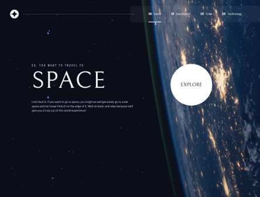
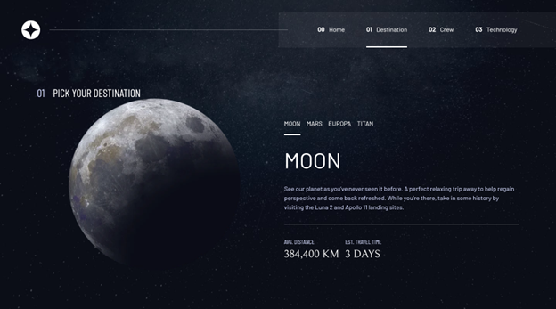
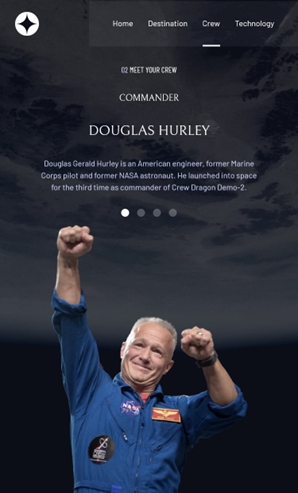
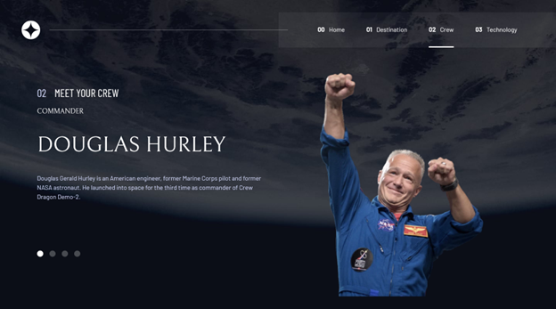
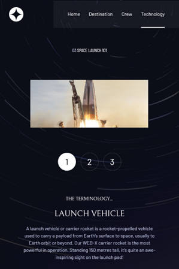
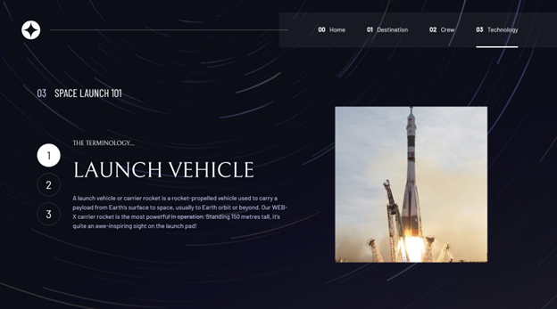

# Frontend Mentor - Space tourism website solution

This is a solution to the [Space tourism website challenge on Frontend Mentor](https://www.frontendmentor.io/challenges/space-tourism-multipage-website-gRWj1URZ3). Frontend Mentor challenges help you improve your coding skills by building realistic projects. 

## Table of contents

- [Overview](#overview)
  - [The challenge](#the-challenge)
  - [Screenshot](#screenshot)
  - [Links](#links)
- [My process](#my-process)
  - [Built with](#built-with)
  - [What I learned](#what-i-learned)
  - [Continued development](#continued-development)
  - [Useful resources](#useful-resources)
- [Author](#author)
- [Acknowledgments](#acknowledgments)

## Overview

### The challenge

Users should be able to:

- View the optimal layout for each of the website's pages depending on their device's screen size
- See hover states for all interactive elements on the page
- View each page and be able to toggle between the tabs to see new information

### Screenshot

### Links

- Solution URL: [https://github.com/toshirokubota/space-tourism-website](https://github.com/toshirokubota/space-tourism-website)
- Live Site URL: [https://toshirokubota.github.io/space-tourism-website/](https://toshirokubota.github.io/space-tourism-website/)

## My process

### Built with

- Semantic HTML5 markup
- CSS custom properties
- Flexbox
- CSS Grid
- Mobile-first workflow
- SCSS

### What I learned

I followed (up to the home page design) Kevin Powell's development on Scrimba. It was helpful to kick start the project, and to learn how to improve the accessibility, how to organize the design with custom variables, and how to balance between utility classes and component classes in CSS. 

I am not very comfortable with asynchronous programming, especially with promises and async/await. But I could practice more in this project and I am more comfortable with them than before...

I did use export/import of functions, although that was not really necessary. 

### Continued development

I continue on the advanced CSS learning path.

### Useful resources

## Author

- Frontend Mentor - [@toshirokubota](https://www.frontendmentor.io/profile/toshirokubota)

## Acknowledgments

